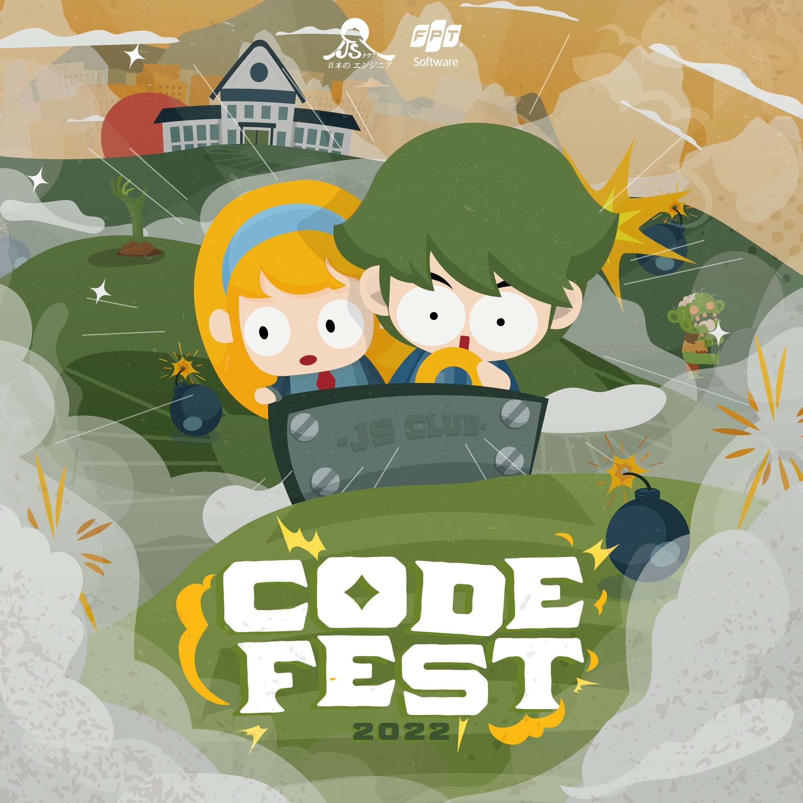

<h2 align="center">JSClub Codefest SDK</h2>

## Introduction

💻 C𝐨𝐝𝐞𝐟𝐞𝐬𝐭 là một sự kiện học thuật được tổ chức bởi [JS Club](https://www.facebook.com/fu.jsclub) với mong muốn đem đến cho những bạn sinh viên đam mê công nghệ thông tin một sân chơi trí tuệ với hình thức thi đấu mới lạ chưa từng có tại trường đại học FPT.

💻 𝐂𝐨𝐝𝐞𝐟𝐞𝐬𝐭 được tạo ra nhằm mục đích giúp người tham gia nâng cao kiến thức lập trình, tạo cơ hội ứng dụng lập trình vào thực tế, tăng kỹ năng quản lý dự án và làm việc nhóm.

🧟 𝐂𝐇𝐔̉ Đ𝐄̂̀ 𝐂𝐔𝐎̣̂𝐂 𝐓𝐇𝐈:
Để trở thành người chiến thắng trong mỗi trận đấu, các bạn sẽ phải code con bot điều khiển được trận game. Con bot đó có thể đặt bom tiêu diệt đối thủ của mình, tiêu diệt zombie, giải cứu những người bệnh và phải sống sót đến cuối cùng.

### JSClub Codefest SDK
JSClub Codefest SDK là SDK (Software Development Kit) - bộ công cụ hỗ trợ cho các thí sinh tham gia Codefest.

Các chức năng chính:
- Kết nối với Server thi đấu.
- Cung cấp các util xử lý dữ liệu.
- Cũng cấp thuật toán tìm đường (A* Search).

## Requirements
- JDK 11

## Installation
Bạn có thể tải file Jar của SDK ở phần [Release](https://github.com/DAN3002/JSClub-CodeFest-SDK/releases), hãy tải bản mới nhất của SDK và cài đặt vào Project của bạn.

## How to start
Sau khi cài đặt thành công file Jar, bạn hãy tham khảo [Tài liệu](https://github.com/DAN3002/JSClub-CodeFest-SDK/wiki/Getting-Started) để có thể bắt đầu sử dụng SDK.

## Issues
Trước khi báo lỗi vui lòng đọc trang [Những vấn đề thường gặp](https://github.com/DAN3002/JSClub-CodeFest-SDK/wiki/Common-Issues) và tìm vấn đề của mình ở trong đó.
Nếu trang phía trên không giải quyết vấn đề của bạn, vui lòng báo lỗi [tại đây](https://github.com/DAN3002/JSClub-CodeFest-SDK/issues)
